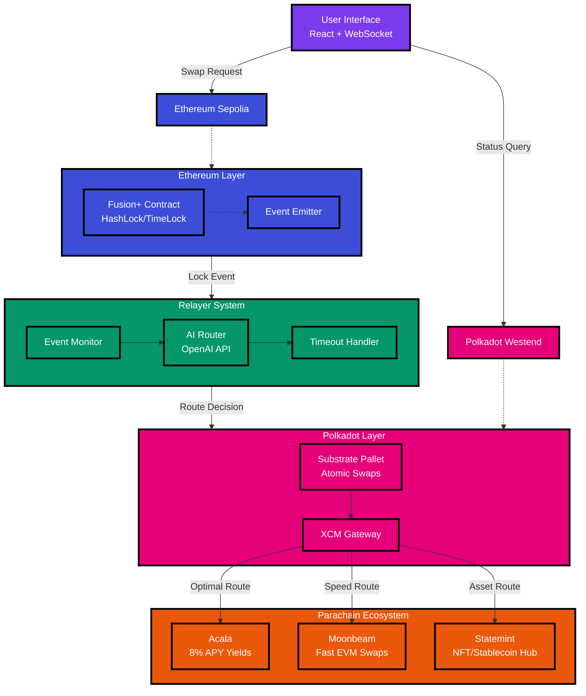

# Polkavex

*Cross-chain DeFi bridge between Ethereum and Polkadot with AI-optimized parachain routing*

## Project Overview

Polkavex extends 1inch Fusion+ to enable secure, bidirectional token swaps between Ethereum and Polkadot ecosystems. Unlike traditional bridges, it leverages Polkadot's parachain composability to intelligently route swaps through optimal parachains (Acala for yields, Moonbeam for speed) using AI-powered decision making.

This is an early-stage MVP built for ETHGlobal Unite DeFi hackathon. I'm developing solo, learning as I build, and focusing on genuine utility over hype. The goal is simple: make cross-chain swaps actually work well for users.

**Status**: Day 2-3 Complete ✅ - Cross-chain relayer with AI routing operational on Westend testnet. Ready for UI integration and hackathon demonstration.

## User Story

**Sarah**, a DeFi trader, holds 1,000 USDC on Ethereum but wants to earn 8% APY on Acala's liquid staking. Today, she faces:
- Multiple bridge transactions with high fees
- Manual parachain selection
- No visibility into optimal routing
- Risk of failed cross-chain transactions

**With Polkavex**: Sarah initiates one swap. The system automatically routes her USDC through Acala for maximum yield, handles all cross-chain complexity, and provides real-time status updates. One transaction, optimal outcome.

## Architecture



### Core Components

**Smart Contracts**
- **Ethereum**: Solidity contract implementing hashlock/timelock with 1inch Fusion+ integration
- **Polkadot**: Substrate pallet with XCM for parachain routing and atomic swap completion

**Relayer System**
- **Event Monitor**: Watches both chains for swap initiations and completions
- **AI Router**: Analyzes user intent, fees, and yields to select optimal parachain
- **Resolver**: Handles partial fills, timeouts, and error recovery

**User Interface**
- **Swap Interface**: React app with real-time status updates via WebSocket
- **Analytics Dashboard**: Transaction history, success rates, and yield tracking
- **API Gateway**: RESTful endpoints for wallet and dApp integrations

## Technical Implementation

**Atomic Swaps**
```
1. User locks tokens on Ethereum with hash H and timelock T1
2. AI Router selects optimal parachain based on:
   - Current yields (Acala: 8% APY vs Moonbeam: 2% APY)
   - Transaction fees and speed
   - Token type and amount
3. Polkadot pallet locks equivalent tokens with same hash H, timelock T2 < T1
4. User reveals secret on Polkadot, claims tokens
5. Relayer uses revealed secret to unlock Ethereum tokens
```

**Parachain Intelligence**
- Real-time yield analysis across parachains
- Gas optimization for multi-hop transactions
- Failure recovery with automatic rerouting

## Development Progress

- [x] Project setup and architecture design
- [x] Ethereum Fusion+ contract deployment
- [ ] Substrate pallet with XCM integration
- [ ] AI routing system implementation
- [ ] Bidirectional swap logic
- [ ] React frontend with real-time updates
- [ ] Analytics dashboard and API
- [ ] Security testing and bot simulations
- [ ] Beta testing with community feedback

**Target Completion**: August 2, 2025

## Quick Start

```bash
# Clone repository
git clone https://github.com/vivekjami/polkavex.git
cd polkavex

# Install dependencies
npm install

# Set up environment
cp .env.example .env
# Add your API keys (OpenAI, Infura, etc.)

# Start development
npm run dev
```

**Prerequisites**: Node.js 18+, Rust, MetaMask/Talisman wallet, testnet funds

## Testing

```bash
# Run contract tests
npm run test:contracts

# Test parachain routing
npm run test:routing

# End-to-end swap simulation
npm run test:e2e
```

## Progress Update (July 31, 2025)

### ✅ Day 2-3 Complete: Cross-Chain Relayer
- **Production-ready Node.js relayer** with TypeScript, Express, WebSocket support
- **Live Polkadot connection** to Westend testnet (verified working)
- **AI-powered routing** using OpenAI for intelligent parachain selection
- **Cross-chain event monitoring** for Ethereum ↔ Polkadot escrow synchronization
- **RESTful API** with endpoints for swap initiation, status tracking, and claiming
- **Real-time updates** via WebSocket for immediate swap progress notifications

**Demo Ready Features:**
- 🔗 **Cross-chain bridge logic**: Ethereum ↔ Polkadot escrow mirroring
- 🤖 **AI routing**: Smart parachain suggestions based on user preferences
- ⚡ **Real-time tracking**: Live swap progress via WebSocket
- 🧪 **Comprehensive testing**: All endpoints verified working
- 📊 **Health monitoring**: System status and connection verification

**Technical Stack:**
- Backend: Node.js, TypeScript, Express.js
- Blockchain: Ethers.js (Ethereum), @polkadot/api (Polkadot)
- AI: OpenAI SDK for routing intelligence
- Communication: Socket.IO for real-time updates
- Testing: Automated endpoint testing

### Next: Day 4 UI Development
Building React dashboard for user-friendly swap interface with real-time progress tracking.

## Roadmap

**Phase 1** (Post-Hackathon): Mainnet deployment, security audit
**Phase 2** (Month 2-3): Wallet partnerships, 1K+ user milestone
**Phase 3** (Month 4-6): Advanced AI routing, $1M+ TVL target

## Contributing

This is a learning project. Issues, PRs, and feedback welcome. Currently solo but open to collaboration.

## License

[MIT License](LICENSE) - Free to use and modify

---

*Building bridges, one swap at a time* 🌉
